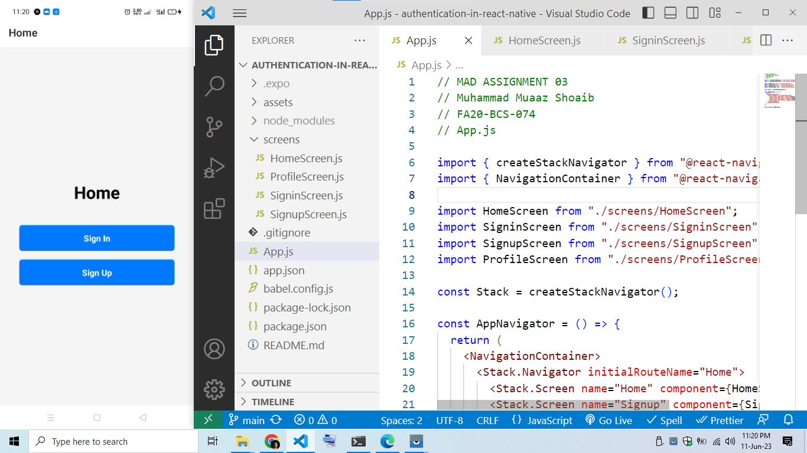
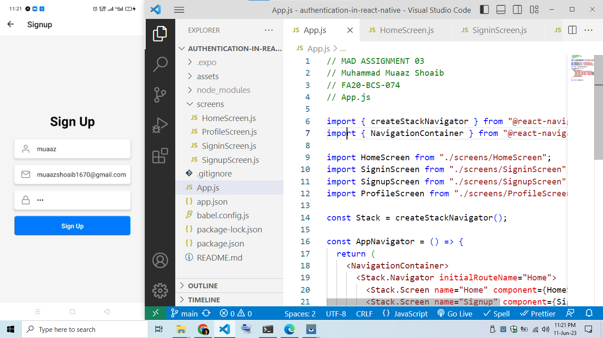
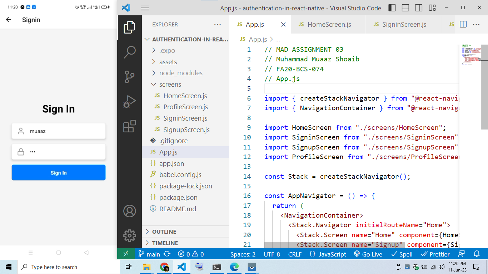
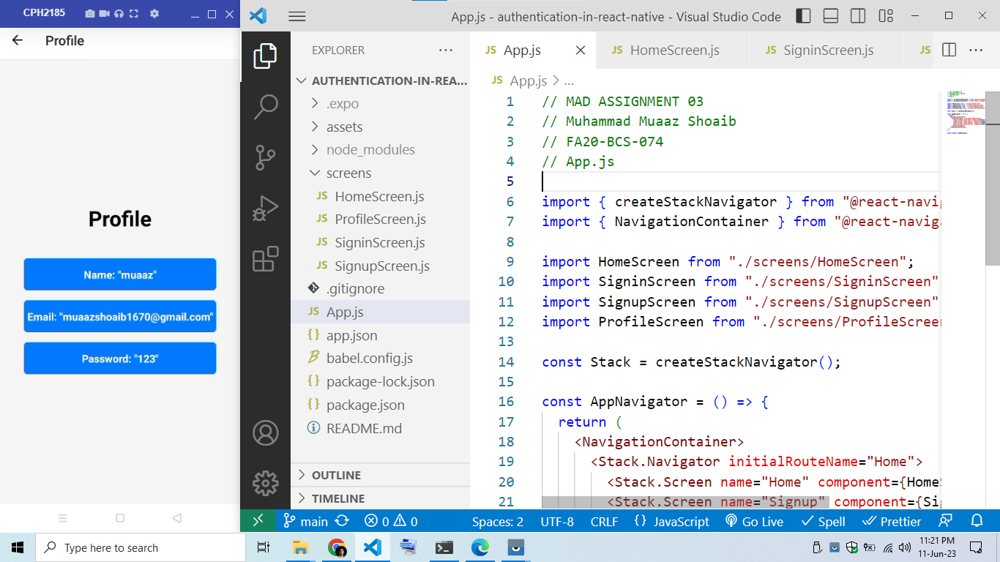

# MAD Assignment 04
 
Extend the Assignment 3, and store the information submitted by user in sign up form inside local storage. And then in Login form retrieve that information and if valid information provided by the user, redirect him to profile screen

